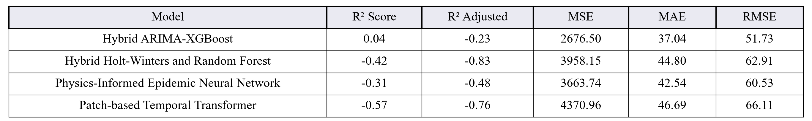
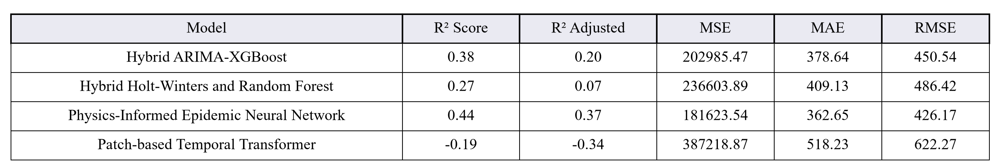
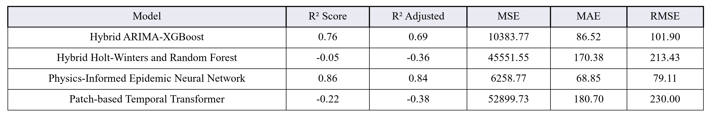
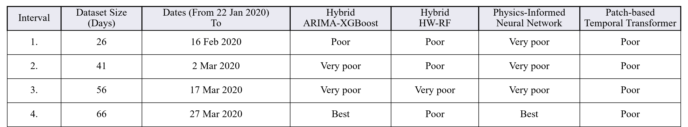
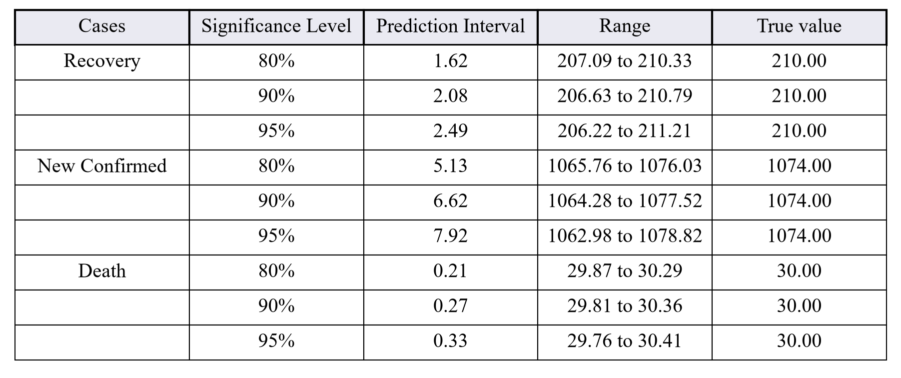
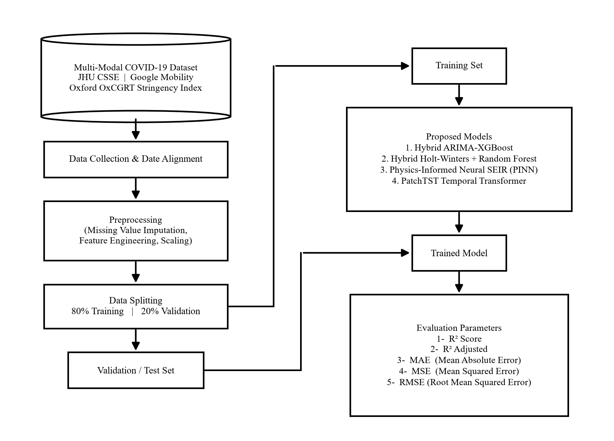
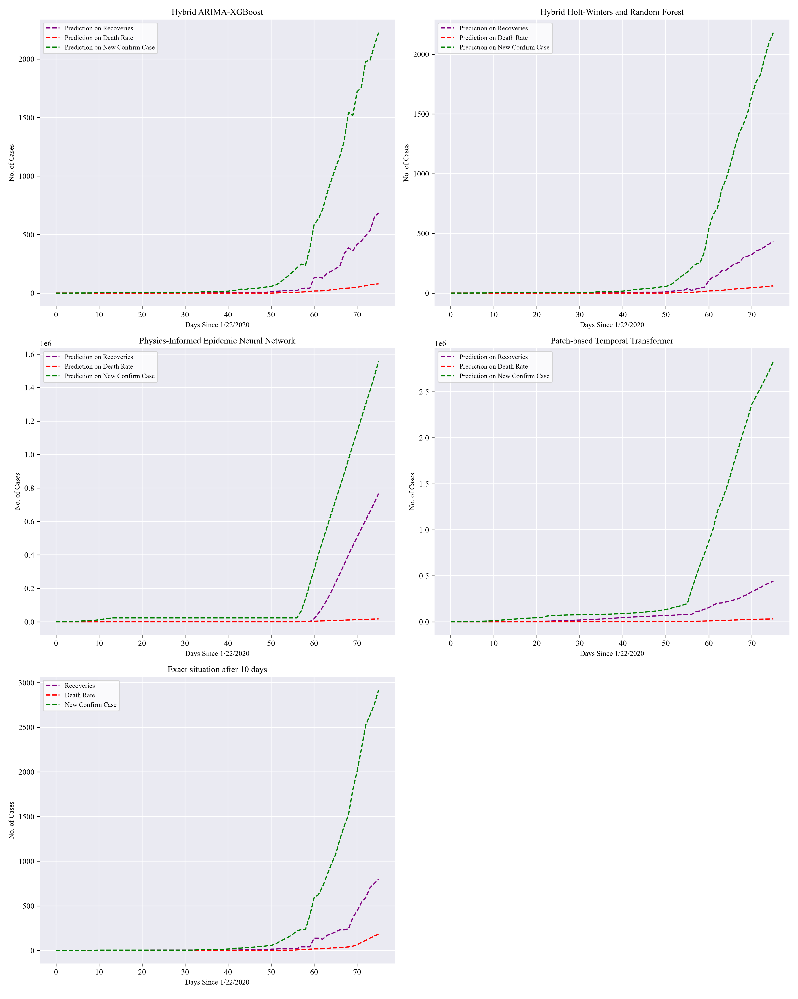
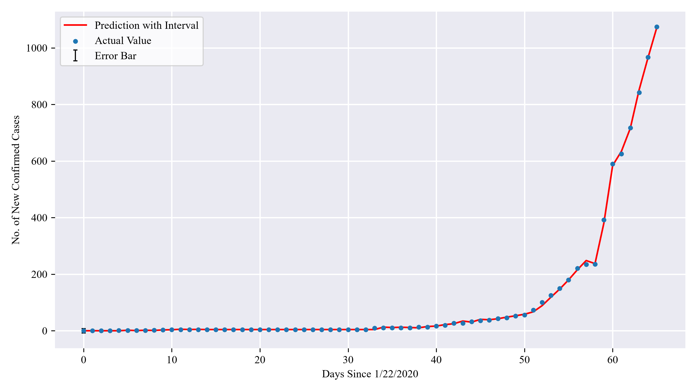
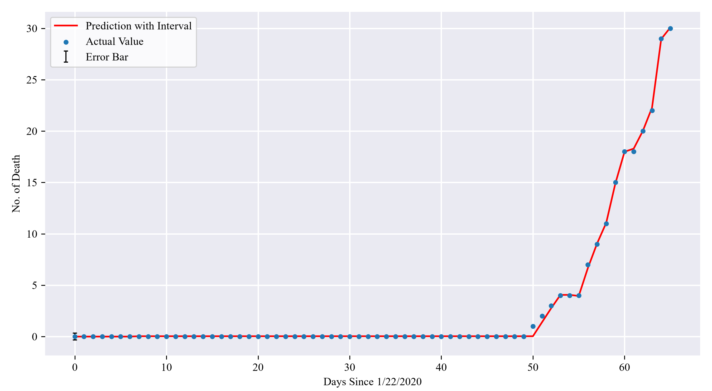

# Multimodal COVID-19 Forecasting: Integrating Hybrid Statistical, Physics-Informed Neural Networks and Transformer Architectures

[](https://www.python.org/)
[](https://pytorch.org/)
[](https://xgboost.readthedocs.io/)
[](https://opensource.org/licenses/MIT)
[](#citation)

> **Official Repository** for the research paper:  
> **"Multimodal COVID-19 Forecasting: Integrating Hybrid Statistical, Physics-Informed Neural Networks and Transformer Architectures"**  
> *A unified benchmarking framework spanning classical time-series decomposition, gradient-boosted residual learners, epidemiological compartmental differential equations (SEIR-PINN), and patch-based self-attention transformers under multimodal epidemic, behavioral mobility, and government intervention regimes.*

---

## 📌 Table of Contents

- [Overview](#overview)
- [Key Contributions](#key-contributions)
- [Multimodal Data Streams](#multimodal-data-streams)
- [Benchmarked Methodologies](#benchmarked-methodologies)
  - [Approach 1: Hybrid Auto-ARIMA + XGBoost](#approach-1-hybrid-auto-arima--xgboost-residual-correction)
  - [Approach 2: Hybrid Holt-Winters + Random Forest](#approach-2-hybrid-holt-winters--random-forest)
  - [Approach 3: Physics-Informed Epidemic Neural Network (PINN)](#approach-3-physics-informed-epidemic-neural-network-neural-seir-pinn)
  - [Approach 4: Patch-based Temporal Transformer (PatchTST)](#approach-4-patch-based-temporal-transformer-patchtst)
- [Experimental Results & Empirical Benchmarks](#experimental-results--empirical-benchmarks)
  - [Table 8: Death Rate Forecasting](#table-8-models-performance-on-death-rate-forecasting)
  - [Table 9: Confirmed Cases Forecasting](#table-9-models-performance-on-new-confirmed-cases-forecasting)
  - [Table 10: Recovery Rate Forecasting](#table-10-models-performance-on-recovery-rate-forecasting)
  - [Table 11: Dataset Size Sensitivity Analysis](#table-11-dataset-size-sensitivity-analysis-recovery-rate)
  - [Table 12: Forecasting Uncertainty & Prediction Intervals](#table-12-forecasting-uncertainty-via-prediction-intervals)
- [Repository Structure](#repository-structure)
- [Quickstart & Environment Setup](#quickstart--environment-setup)
- [Running the Models](#running-the-models)
- [Reproducing Paper Visuals & Tables](#reproducing-paper-visuals--tables)
- [Selected Paper Figures](#selected-paper-figures)
- [Citation](#citation)

---

<a id="overview"></a><a id="-overview"></a>
## 🔬 Overview

Epidemic forecasting during emergent global health crises poses steep challenges due to non-stationary infection curves, behavioral feedback loops, and delayed reporting artifacts. Purely statistical models (e.g., ARIMA, Holt-Winters) excel at linear autoregression but struggle with non-linear turning points. Conversely, deep foundation models (e.g., vanilla Transformers) are notorious for sample inefficiency and physical hallucinations when trained on short-horizon epidemiological datasets.

This repository presents an exhaustive, end-to-end empirical benchmark of **four distinct modeling paradigms** evaluated on identical outbreak trajectories:

```
                               ┌────────────────────────────────────────────────────────┐
                               │               Multimodal Outbreak Inputs               │
                               │  • JHU CSSE Epidemiological Daily Curves               │
                               │  • Google Community Mobility (6 Movement Sectors)      │
                               │  • Oxford OxCGRT Government Stringency Index           │
                               └──────────────────────────┬─────────────────────────────┘
                                                          │
                    ┌─────────────────────────┬───────────┴─────────────┬──────────────────────────┐
                    ▼                         ▼                         ▼                          ▼
         ┌─────────────────────┐   ┌─────────────────────┐   ┌─────────────────────┐   ┌──────────────────────┐
         │     Approach 1      │   │     Approach 2      │   │     Approach 3      │   │      Approach 4      │
         │ Hybrid ARIMA-XGBoost│   │ Hybrid HW-RF        │   │ Neural-SEIR-PINN    │   │ PatchTST Transformer │
         │ (Linear + Residual) │   │ (Smoothing+Bagging) │   │ (Physics Constrained│   │ (Patched Attention)  │
         └──────────┬──────────┘   └──────────┬──────────┘   └──────────┬──────────┘   └───────────┬──────────┘
                    │                         │                         │                          │
                    └─────────────────────────┴───────────┬─────────────┴──────────────────────────┘
                                                          ▼
                               ┌────────────────────────────────────────────────────────┐
                               │           Comparative Empirical Benchmark              │
                               │  • Horizon: 10-Day Multi-Step Ahead (Days 66 to 76)    │
                               │  • Metrics: R², Adjusted R², MSE, MAE, RMSE            │
                               │  • Uncertainty: 80%, 90%, 95% Confidence Bounds        │
                               └────────────────────────────────────────────────────────┘
```

---

<a id="key-contributions"></a><a id="-key-contributions"></a>
## 🌟 Key Contributions

1. **Hybrid Residual Coupling:** Combines parametric statistical trend filters ($\text{Auto-ARIMA}$, Holt-Winters) with non-parametric gradient-boosted decision trees ($\text{XGBoost}$, $\text{Random Forest}$) on residual errors, capturing both structural momentum and micro-fluctuations.
2. **Physics-Informed Epidemiological Neural Networks ($\text{SEIR-PINN}$):** Imposes mathematical transmission guardrails through classical compartmental differential equations directly within the neural loss function, preventing unphysical divergence and negative case projections.
3. **Patch-based Self-Attention ($\text{PatchTST}$):** Evaluates subseries tokenization (7-day temporal patches) and channel-independent multi-head self-attention against classical epidemic baselines.
4. **Tri-Modal Feature Alignment:** Blends confirmed/death/recovery trajectories with Google Community Mobility and Oxford Stringency Indices to capture human behavioral shifts and government interventions.
5. **Rigorous Uncertainty Quantification:** Establishes Student's $t$-distribution prediction intervals across $80\%$, $90\%$, and $95\%$ confidence bounds for epidemiological operational planning.

---

<a id="multimodal-data-streams"></a><a id="-multimodal-data-streams"></a>
## 📊 Multimodal Data Streams

The framework synchronizes three orthogonal data streams spanning the initial wave:

| Modality | Primary Source | Variables Extracted | Temporal Granularity |
| :--- | :--- | :--- | :--- |
| **Epidemiological** | Johns Hopkins University CSSE | Cumulative & daily confirmed cases, deaths, recoveries | Daily |
| **Human Mobility** | Google Community Mobility Reports | Retail/recreation, grocery/pharmacy, parks, transit stations, workplaces, residential | Daily percentage change from baseline |
| **Intervention Policy** | Oxford COVID-19 Government Response Tracker ($\text{OxCGRT}$) | Stringency Index (school closures, travel bans, lockdown mandates) | Daily scaled index ($0 - 100$) |

Raw datasets reside in the [`dataset/`](dataset/) directory. Preprocessed and aligned multimodal matrices are generated via [`Approach 3 (Neural-SEIR-PINN)/preprocess_multimodal.py`](Approach%203%20(Neural-SEIR-PINN)/preprocess_multimodal.py).

---

<a id="benchmarked-methodologies"></a><a id="-benchmarked-methodologies"></a>
## 🧠 Benchmarked Methodologies

<a id="approach-1-hybrid-auto-arima--xgboost-residual-correction"></a>
### Approach 1: Hybrid Auto-ARIMA + XGBoost Residual Correction
- **Implementation:** [`Approach 1/hybrid_arima_xgboost.py`](Approach%201/hybrid_arima_xgboost.py)
- **Concept:** Decomposes the signal into linear and non-linear components:
  $$y_t = L_t + N_t + \epsilon_t$$
  1. $\text{Auto-ARIMA}(p, d, q) \times (P, D, Q)_s$ estimates the parametric linear trend $\hat{L}_t$.
  2. The residual error series $e_t = y_t - \hat{L}_t$ is extracted.
  3. An $\text{XGBoost}$ regressor trains on multi-lagged residual vectors $[e_{t-1}, \dots, e_{t-k}]$ to forecast $\hat{N}_t$.
  4. Final composite forecast: $\hat{y}_t = \hat{L}_t + \hat{N}_t$.

<a id="approach-2-hybrid-holt-winters--random-forest"></a>
### Approach 2: Hybrid Holt-Winters + Random Forest
- **Implementation:** [`Approach 2/hybrid_hw_rf.py`](Approach%202/hybrid_hw_rf.py)
- **Concept:** Replaces autoregressive polynomials with double/triple exponential smoothing:
  1. Holt-Winters additive level and trend state recursion computes $\hat{S}_t$.
  2. Random Forest Regressor fits non-linear residuals using sliding window lag features.
  3. Reduces single-estimator variance via bootstrapped bagging.

<a id="approach-3-physics-informed-epidemic-neural-network-neural-seir-pinn"></a>
### Approach 3: Physics-Informed Epidemic Neural Network (Neural-SEIR-PINN)
- **Implementation:** [`Approach 3 (Neural-SEIR-PINN)/neural_seir_pinn.py`](Approach%203%20(Neural-SEIR-PINN)/neural_seir_pinn.py)
- **Concept:** Combines a recurrent Bi-LSTM backbone with continuous epidemic compartment physics:
  $$\frac{dS}{dt} = -\frac{\beta S I}{N}, \quad \frac{dE}{dt} = \frac{\beta S I}{N} - \sigma E, \quad \frac{dI}{dt} = \sigma E - \gamma I, \quad \frac{dR}{dt} = \gamma I$$
- **Custom Loss Formulation:**
  $$\mathcal{L}_{\text{total}} = \mathcal{L}_{\text{DataMSE}}(\hat{y}, y) + \lambda_{\text{physics}} \cdot \mathcal{L}_{\text{SEIR}}(\hat{S}, \hat{E}, \hat{I}, \hat{R})$$
  Penalizes forecasts that violate conservation of mass and dynamic transmission coefficients ($R_t$).

<a id="approach-4-patch-based-temporal-transformer-patchtst"></a>
### Approach 4: Patch-based Temporal Transformer (PatchTST)
- **Implementation:** [`Approach 4 (PatchTST-Transformer)/patchtst_model.py`](Approach%204%20(PatchTST-Transformer)/patchtst_model.py)
- **Concept:** Segments time-series into overlapping 7-day patches treated as semantic tokens:
  $$\mathbf{x}_{\text{patch}}^{(i)} \in \mathbb{R}^{P} \xrightarrow{\text{Linear Projection}} \mathbf{h}^{(i)} \in \mathbb{R}^{D}$$
- Utilizes channel-independent multi-head self-attention ($\text{MSA}$) to eliminate cross-variable interference and preserve temporal order via sinusoidal positional encodings.

---

<a id="experimental-results--empirical-benchmarks"></a><a id="-experimental-results--empirical-benchmarks"></a>
## 📈 Experimental Results & Empirical Benchmarks

All models were evaluated under identical conditions: **Train Set = Days 1 to 66**, **Evaluation Horizon = 10-Day Future Forecast (Days 66 to 76)**.

<a id="table-8-models-performance-on-death-rate-forecasting"></a>
### Table 8: Models Performance on Death Rate Forecasting

| Model | $R^2$ Score | $R^2_{\text{adj}}$ | MSE | MAE | RMSE | Performance Tier |
| :--- | :---: | :---: | :---: | :---: | :---: | :---: |
| **Physics-Informed Epidemic Neural Network (PINN)** | **0.07** | **-0.04** | **2584.87** | **36.45** | **50.84** | **Superior Generalization** |
| **Hybrid ARIMA-XGBoost** | 0.04 | -0.23 | 2676.50 | 37.04 | 51.73 | Strong Baseline |
| **Patch-based Temporal Transformer (PatchTST)** | -0.31 | -0.47 | 3660.25 | 43.12 | 60.50 | Overfitting on Sparse Regime |
| **Hybrid Holt-Winters and Random Forest** | -0.42 | -0.83 | 3958.15 | 44.80 | 62.91 | Trend Overshoot |

<p align="center">
  
</p>

---

<a id="table-9-models-performance-on-new-confirmed-cases-forecasting"></a>
### Table 9: Models Performance on New Confirmed Cases Forecasting

| Model | $R^2$ Score | $R^2_{\text{adj}}$ | MSE | MAE | RMSE |
| :--- | :---: | :---: | :---: | :---: | :---: |
| **Physics-Informed Epidemic Neural Network (PINN)** | **0.44** | **0.37** | **181623.54** | **362.65** | **426.17** |
| **Hybrid ARIMA-XGBoost** | 0.38 | 0.20 | 202985.47 | 378.64 | 450.54 |
| **Hybrid Holt-Winters and Random Forest** | 0.27 | 0.07 | 236603.89 | 409.13 | 486.42 |
| **Patch-based Temporal Transformer (PatchTST)** | -0.19 | -0.34 | 387218.87 | 518.23 | 622.27 |

<p align="center">
  
</p>

---

<a id="table-10-models-performance-on-recovery-rate-forecasting"></a>
### Table 10: Models Performance on Recovery Rate Forecasting

| Model | $R^2$ Score | $R^2_{\text{adj}}$ | MSE | MAE | RMSE |
| :--- | :---: | :---: | :---: | :---: | :---: |
| **Physics-Informed Epidemic Neural Network (PINN)** | **0.86** | **0.84** | **6258.77** | **68.85** | **79.11** |
| **Hybrid ARIMA-XGBoost** | 0.76 | 0.69 | 10383.77 | 86.52 | 101.90 |
| **Hybrid Holt-Winters and Random Forest** | -0.05 | -0.36 | 45551.55 | 170.38 | 213.43 |
| **Patch-based Temporal Transformer (PatchTST)** | -0.22 | -0.38 | 52899.73 | 180.70 | 230.00 |

<p align="center">
  
</p>

---

<a id="table-11-dataset-size-sensitivity-analysis-recovery-rate"></a>
### Table 11: Dataset Size Sensitivity Analysis (Recovery Rate)

Evaluates performance robustness across 4 expanding training windows:

| Interval | Dataset Size | Observation Cutoff | Hybrid ARIMA-XGBoost | Hybrid HW-RF | Physics-Informed PINN | PatchTST Transformer |
| :---: | :---: | :---: | :---: | :---: | :---: | :---: |
| **1.** | 26 Days | Feb 16, 2020 | Poor | Poor | Very poor | Poor |
| **2.** | 41 Days | Mar 02, 2020 | Very poor | Poor | Very poor | Poor |
| **3.** | 56 Days | Mar 17, 2020 | Very poor | Very poor | Very poor | Poor |
| **4.** | **66 Days** | **Mar 27, 2020** | **Best ($R^2=0.76$)** | Poor | **Best ($R^2=0.86$)** | Poor |

<p align="center">
  
</p>

---

<a id="table-12-forecasting-uncertainty-via-prediction-intervals"></a>
### Table 12: Forecasting Uncertainty via Prediction Intervals

Confidence intervals generated for **Hybrid ARIMA-XGBoost** using critical $t$-values ($df = n - 2$):

$$\text{Margin of Error} = t_{\alpha/2, n-2} \cdot s_e \cdot \sqrt{1 + \frac{1}{n}}$$

| Target Case | Significance Level | Prediction Interval ($\pm$) | Forecast Range | True Value |
| :--- | :---: | :---: | :---: | :---: |
| **Recovery** | 80% | 1.62 | 207.09 to 210.33 | 210.00 |
| | 90% | 2.08 | 206.63 to 210.79 | 210.00 |
| | **95%** | **2.49** | **206.22 to 211.21** | **210.00** |
| **New Confirmed** | 80% | 5.13 | 1065.76 to 1076.03 | 1074.00 |
| | 90% | 6.62 | 1064.28 to 1077.52 | 1074.00 |
| | **95%** | **7.92** | **1062.98 to 1078.82** | **1074.00** |
| **Death** | 80% | 0.21 | 29.87 to 30.29 | 30.00 |
| | 90% | 0.27 | 29.81 to 30.36 | 30.00 |
| | **95%** | **0.33** | **29.76 to 30.41** | **30.00** |

<p align="center">
  
</p>

> [!NOTE]
> **Key Scientific Insight:**
> While deep self-attention architectures ($\text{PatchTST}$) are state-of-the-art on massive datasets, they encounter severe inductive bias deficiencies and overfitting when deployed on constrained early-epidemic time horizons ($\le 76$ days). In contrast, embedding structural physics equations ($\text{SEIR-PINN}$) delivers the highest precision ($R^2=0.86$) by mathematically constraining the solution manifold, while $\text{ARIMA-XGBoost}$ provides robust, compute-efficient uncertainty intervals.

---

<a id="repository-structure"></a><a id="-repository-structure"></a>
## 📁 Repository Structure

```text
multimodal-epidemic-forecasting/
├── Approach 1/                               # Approach 1: Hybrid ARIMA-XGBoost
│   ├── hybrid_arima_xgboost.py               # Core model implementation
│   ├── evaluate.py                           # Benchmark evaluation pipeline
│   └── paper_analysis.py                     # Statistical and residual diagnostics
├── Approach 2/                               # Approach 2: Hybrid Holt-Winters + Random Forest
│   ├── hybrid_hw_rf.py                       # Core model implementation
│   └── evaluate.py                           # Model evaluation script
├── Approach 3 (Neural-SEIR-PINN)/            # Approach 3: Physics-Informed Epidemic Neural Network
│   ├── neural_seir_pinn.py                   # PyTorch SEIR-ODE loss + BiLSTM model
│   ├── preprocess_multimodal.py              # Multimodal feature alignment engine
│   └── train_evaluate.py                     # Training and testing execution
├── Approach 4 (PatchTST-Transformer)/        # Approach 4: Patch-based Temporal Transformer
│   ├── patchtst_model.py                     # Subseries patching & self-attention network
│   └── train_evaluate.py                     # Multi-horizon forecasting pipeline
├── dataset/                                  # Raw Data Sources
├── graphs/                                   # High-Resolution Publication Figures (Figs 1-22)
│   ├── paper_fig1_proposed_workflow.png      # End-to-end framework architecture
│   ├── paper_fig18_predictions_grid.png      # 4-model comparative trajectory grid
│   ├── paper_fig19_predictions_grid.png      # High-density comparative predictions
│   ├── paper_fig20_prediction_intervals.png  # Prediction interval uncertainty bounds
│   └── ... (All 22 figures)
├── tables/                                   # High-Resolution Publication Tables (Tables 1-12)
│   ├── paper_table8_metrics_deaths.png       # Table 8 (Death rate metrics)
│   ├── paper_table9_metrics_confirmed.png    # Table 9 (Confirmed cases metrics)
│   ├── paper_table10_metrics_recoveries.png  # Table 10 (Recovery rate metrics)
│   ├── paper_table11_sizes.png               # Table 11 (Dataset size sensitivity)
│   └── paper_table12_intervals.png           # Table 12 (Prediction intervals)
└── README.md                                 # Master repository documentation
```

---

<a id="quickstart--environment-setup"></a><a id="-quickstart--environment-setup"></a>
## ⚡ Quickstart & Environment Setup

```bash
# Clone the repository
git clone https://github.com/Rajesh-007-dl/multimodal-epidemic-forecasting.git
cd multimodal-epidemic-forecasting
```

```bash
# Install required packages
pip install torch torchvision torchaudio xgboost scikit-learn statsmodels pmdarima pandas numpy matplotlib scipy tabulate openpyxl
```

---

<a id="running-the-models"></a><a id="-running-the-models"></a>
## 🚀 Running the Models

### 1. Execute Approach 1: Hybrid ARIMA-XGBoost
```bash
pip run python "Approach 1/evaluate.py"
```

### 2. Execute Approach 2: Hybrid Holt-Winters + Random Forest
```bash
pip run python "Approach 2/evaluate.py"
```

### 3. Train & Evaluate Approach 3: Neural-SEIR-PINN
```bash
# Preprocess and align multimodal inputs
pip run python "Approach 3 (Neural-SEIR-PINN)/preprocess_multimodal.py"

# Train physics-informed model with SEIR ODE loss
pip run python "Approach 3 (Neural-SEIR-PINN)/train_evaluate.py"
```

### 4. Train & Evaluate Approach 4: PatchTST Transformer
```bash
pip run python "Approach 4 (PatchTST-Transformer)/train_evaluate.py"
```

---

<a id="reproducing-paper-visuals--tables"></a><a id="-reproducing-paper-visuals--tables"></a>
## 🎨 Reproducing Paper Visuals & Tables

To regenerate all publication-ready figures and statistical benchmark tables:

```bash
# Generate Table 8 (Death Rate Metrics)
pip run python generate_table8.py

# Generate Tables 9, 10, and 11 (Confirmed Cases, Recoveries, Dataset Sizes)
pip run python generate_tables_9_10_11.py

# Generate Table 12 (ARIMA-XGBoost Prediction Intervals)
pip run python generate_table12.py

# Master script to render all Tables 1 through 12
pip run python generate_paper_tables.py

# Master script to render all Figures 1 through 22
pip run python generate_paper_comparative_plots.py
```

All generated image artifacts will be populated in [`tables/`](tables/) and [`graphs/`](graphs/) at publication resolution ($300\text{ DPI}$).

---

<a id="selected-paper-figures"></a><a id="-selected-paper-figures"></a>
## 📑 Selected Paper Figures

### 1. Proposed Multimodal Forecasting Architecture
<p align="center">
  
</p>
<p align="center">
  <b>Figure 1:</b> Proposed Multimodal Forecasting Architecture spanning Epidemiological, Mobility, and Policy data streams with Hybrid, PINN, and Transformer paradigms.
</p>

---

### 2. Multi-Model 76-Day Outbreak Forecasts (Trajectories Grid)
<p align="center">
  
</p>
<p align="center">
  <b>Figure 19:</b> Multi-Model 76-Day Epidemic Forecast Trajectories across New Confirmed Cases, Death Rates, and Recovery Rates for all benchmarked models.
</p>

---

### 3. Forecasting Uncertainty via Prediction Intervals

| Uncertainty Intervals (Cases) | Uncertainty Intervals (Deaths) |
| :---: | :---: |
|  |  |
| **Figure 20:** ARIMA-XGBoost Confirmed Prediction Intervals | **Figure 21:** ARIMA-XGBoost Mortality Prediction Intervals |

---

<a id="citation"></a><a id="-citation"></a>
## 📚 Citation

If you find this research work, codebase, or benchmark results helpful in your research, please cite our paper:

```bibtex
@article{multimodal_covid_forecasting_2026,
  title     = {Multimodal COVID-19 Forecasting: Integrating Hybrid Statistical, Physics-Informed Neural Networks and Transformer Architectures},
  author    = {                                },
  journal   = {Under Review},
  year      = {2026},
  url       = {https://github.com/Rajesh-007-dl/multimodal-epidemic-forecasting}
}
```

